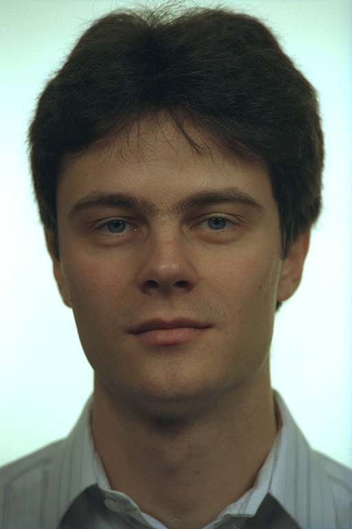
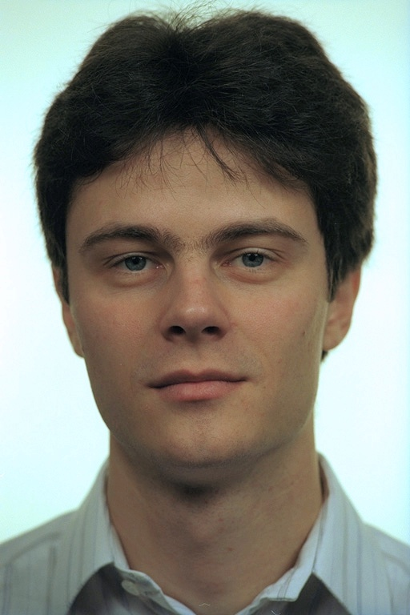
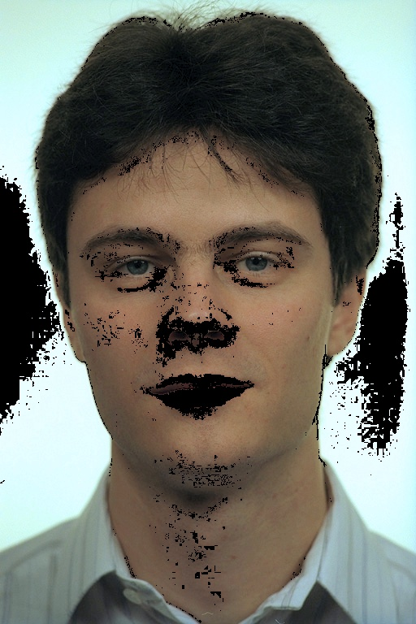
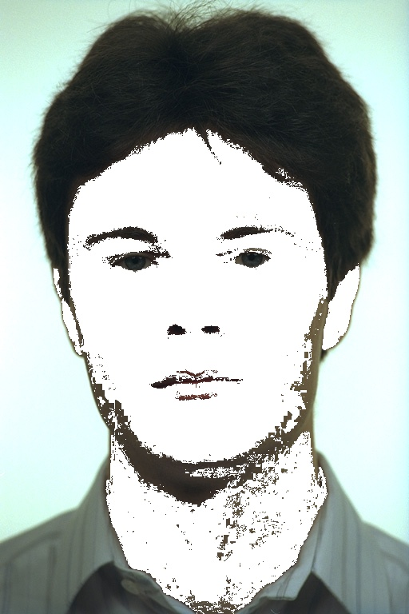
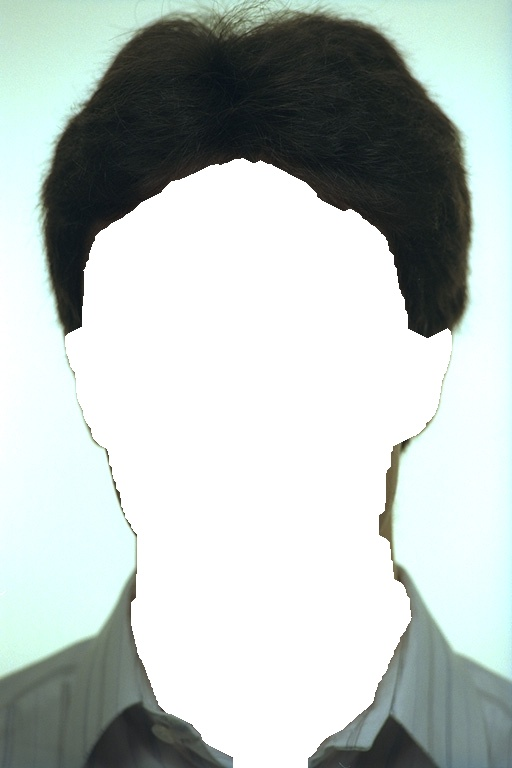

# Elaborazione Delle Immagini 

## 👥 Partecipanti 
* [852239] **Mattia Napoli**
* [851905] **Michele Angelo Marcucci**
* [851649] **Eleonora Cicalla**

## 🔹 Table of content

* Approccio teorico
* Scelta del classificatore e delle features
* Processing del frame
* Risultati
* Codice ed installazione

## 🔸 Approccio teorico

**Obiettivo**: rilevare e segmentare le regioni di pelle umana

Siamo partiti dal capire come "trovare" la pelle in un'immagine cercandola tra gli spazi colore. Tuttavia si è dimostrato essere un metodo poco preciso e abbastanza deludente nei risultati.

Siamo passati quindi a valutare l'idea di usare un classificatore [...]

## 🔸 Classificatore e features

[...]

## 🔸 Processing del frame

Prendiamo come esempio la foto a destra:  le operazioni di processing possiamo suddividerle in 4 macro-categorie:

* Creazione pre-maschera
* Preprocessing
* Processing
* Postprocessing

### Creazione pre-maschera
In molti test abbiamo notato che la maschera fatta attraverso il classificatore rileva anche una parte di pixel "falsi positivi" (quindi rileva pixel non di pelle come pelle) nello sfondo. Questo è causato da ombre, rumore e simili che in fase di preprocessing non riescono a venire eliminati.
Abbiamo quindi pensato di aggiungere una funzione (prima del preprocessing) che prima di creare la maschera, fa una grossolana individuazione dei pixel "nuovi" rispetto allo sfondo (attraverso una dilate lasciamo molto margine di errore per evitare di non selezionare tutto il foreground). 
Quello che otteniamo è una pre-maschera, che scontorna (lasciando una sorta di aura intorno) tutto il foreground. 

**Vantaggi**: abbiamo verificato la quasi totale eliminazione degli "artefatti" che si creano nello sfondo dei video processati.

**Contro**: Non sempre la maschera è perfetta e capita che alcuni pixel di pelle ne restino esclusi.

**Decisione finale**: Abbiamo deciso usare questa funzione dato che in molti test il risultato è abbastanza preciso ed elimina gli artefatti nello sfondo.

### Preprocessing
Il preprocessing del frame comprende le seguenti operazioni (eseguite iterativamente):

**Adaptive gamma correction**

Original             |  Gamma correction
:-------------------------:|:-------------------------:
  |  

**White balance**

Gamma correction             |  White balance
:-------------------------:|:-------------------------:
  |  

**Erase colors**

White balance             |  Erase colors
:-------------------------:|:-------------------------:
  |  

### Processing
Il processing del frame è svolto principalemente attraverso il classificatore [...]

Original                   |  Processed
:-------------------------:|:-------------------------:
  |  

### Postprocessing
Il postprocessing consiste nel [...] perchè [...]

Processed                  |  Postprocessing
:-------------------------:|:-------------------------:
  |  

## 🔸 Risultati

I risultati sono visualizzabili qui: [Video](docs/final.m4v)

## 🔸 Codice ed installazione

Consultare [INSTALL.md](docs/INSTALL.md)
