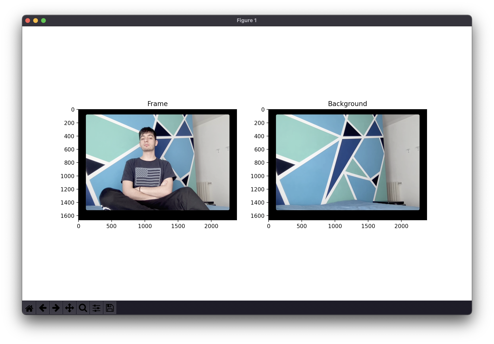
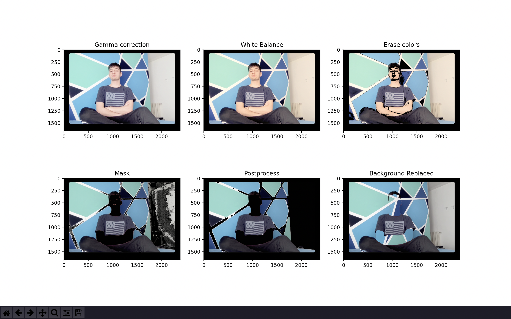
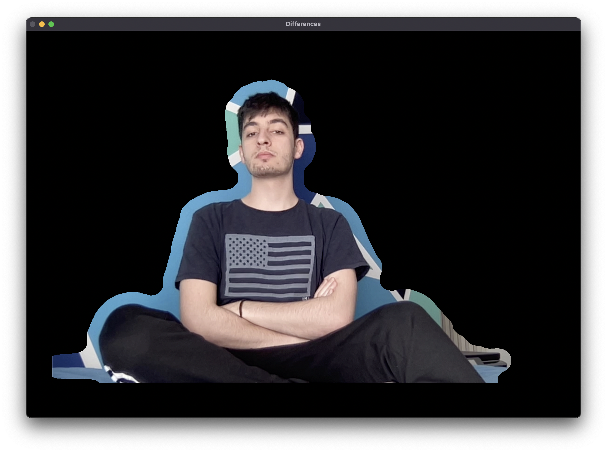

# Elaborazione Delle Immagini 

## 👥 Partecipanti 
* [852239] **Mattia Napoli**
* [851905] **Michele Angelo Marcucci**
* [851649] **Eleonora Cicalla**


## 🔹 Table of content

* Approccio teorico
* Scelta del classificatore e delle features
* Processing del frame
* Risultati
* Codice ed installazione

## 🔸 Approccio teorico

**Obiettivo**: rilevare e segmentare le regioni di pelle umana

Siamo partiti dal capire come "trovare" la pelle in un'immagine cercandola tra gli spazi colore. Tuttavia si è dimostrato essere un metodo poco preciso e abbastanza deludente nei risultati.

Siamo passati quindi a valutare l'idea di usare un classificatore [...]


## 🔸 Classificatore e features

[...]

## 🔸 Processing del frame
Prendiamo come esempio questo frame:


Le operazioni possiamo suddividerle in 3 macro-categorie:

* Preprocessing
* Processing
* Postprocessing

### Preprocessing
Il preprocessing del frame comprende le seguenti operazioni:

- Gamma correction: [serve per ...]
- White balance: [serve per ...]
- Erase colors: [serve per ...]

### Processing
Il processing del frame è svolto principalemente attraverso il classificatore [...]

### Postprocessing
Il postprocessing consiste nel [...] perchè [...]



### Correzioni
Dato che la maschera e il postprocessing rilevano anche una parte di pixel non-skin come skin nello sfondo (causate da ombre, rumore e simili)
abbiamo aggiunto una funzione che prima di creare la maschera, fa una grossolana individuazione dei pixel "nuovi" rispetto allo sfondo (attraverso una dilate lasciamo molto margine di errore per evitare di non selezionare tutto il foreground). Questo ha come vantaggio la quasi totale eliminazione degli "artefatti" che si creano nello sfondo dei video processati.

Ecco un esempio di pre-maschera


## 🔸 Risultati

I risultati sono visualizzabili qui: [Video](docs/final.m4v)

## 🔸 Codice ed installazione

Per prima cosa scaricate o clonate la repo GitHub con:

```
git clone https://github.com/mik3sw/SkinDetection.git
```

Installate le dipendenze necessarie con:

```
cd SkinDetection

pip install -r requirements.txt
```

Eseguite il file <code>setup.py</code> per scaricare il Dataset (operazione automatica). A seconda dell'harware che avete questa operazione può richiedere qualche minuto: il processo di unzipping del dataset (~500 MB) richiede tempo.

```
python3 setup.py
```

Infine eseguite il programma attraverso il file <code>main.py</code>, ecco gli argomenti accettati:
> Consigliamo di usare la flag --multi (o -m) per processare il video passato in input per un incremento sostanziale delle prestazioni.
> 
> Esempio: **python3 main.py -f file.mp4 --multi**
> 
> Esempio **python3 main.py -f file.mp4 -m**


```
usage: main.py [-h] [-f FILE] [--m] [-i]

== PROGETTO ELABORAZIONE DELLE IMMAGINI ==

optional arguments:
  -h, --help            show this help message and exit
  -f FILE, --file FILE  video file to process
  -m, --multi           try multithread
  -i, --info            show info
  

Sample usage:
main.py                         | launch interactive cam session
main.py -f filename             | process given file
main.py -f filename --multi     | process given file using multithreading

```

