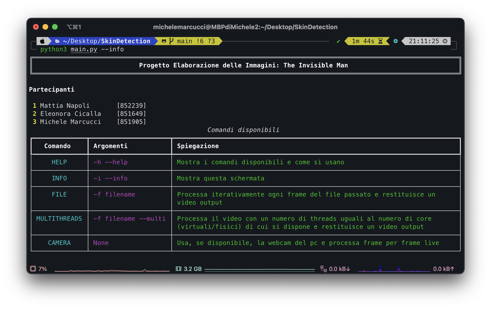
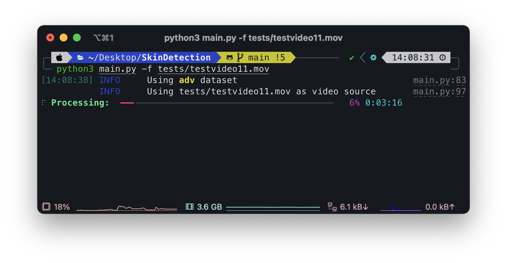
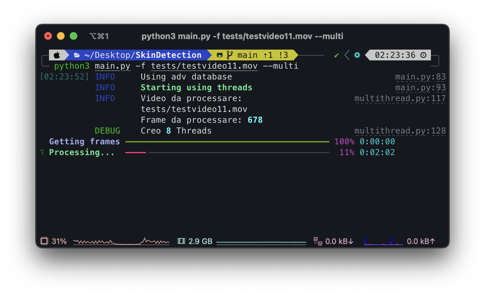

# Installation

## Download
Tramite questo [link]() è possibile scaricare i file principali del progetto.

## Creazione env
Consigliamo, ma non è obbligatorio, creare un python env con tutte le dipendenze necessarie (all'interno la cartella del progetto).

```
python3 -m venv env
```

Se siete su Windows, dovrete poi attivare l'env attraverso:

```
env\Scripts\activate.bat
```

Se siete su macOS o Linux l'env si attiva con:

```
source env/bin/activate
```

## Installazione dipendenze

Navigate nella cartella del progetto ed eseguite il comando

```
pip install -r requirements.txt
``` 


## Download dataset

Abbiamo disposto un file che automaticamente scarica il dataset (~500MB) e crea le path necessarie al funzionamento. Per eseguirlo usate:

```
python setup.py
```
oppure

```
python3 setup.py
```

Questo procedimento richiederà del tempo, anche in base alla velocità della connessione di cui si dispone.

## Avvio del programma

Una volta scaricati tutti i file necessari, servirà solo avviare il programma, attraverso la flag <code>--help o -h</code> verranno visualizzate a video le diverse opzioni disponibili

```
python3 main.py -h
```
Otterrete questo output:

```
usage: main.py [-h] [-f FILE] [--m] [-i]

== PROGETTO ELABORAZIONE DELLE IMMAGINI ==

optional arguments:
  -h, --help            show this help message and exit
  -f FILE, --file FILE  video file to process
  -m, --multi           use multithread
  -i, --info            show info
  

Sample usage:
main.py                         | launch interactive cam session
main.py -f filename             | process given file
main.py -f filename --multi     | process given file using multithreading
```
### Info
<code>python3 main.py --info</code>


### Primo avvio
Durante il primo avvio verrà creato per la prima volta il classificatore (e verrà anche creata la cache nella cartella omonima per evitare di ricrearlo ad ogni avvio del programma). Questa operazione richiede del tempo.

### Sessione live webcam
Per far partire una sessione live (quindi usando la webcam) usate <code>python3 main.py</code> senza flags. Attenzione, la velocità di rendering dei frame varia a seconda dell'hardware di cui si dispone ma in generale è lenta, si riusciranno a vedere solo pochi frame al secondo. Inoltre la precisione è minore rispetto al processing di un video passato in input, ma comunque fornisce un esempio di funzionamento.

Appena avviata verrà visualizzata l'inquadratura della camera, quando pronti dovrete premere il tasto '**q**', verrà scattata una foto che sarà usata come sfondo della scena (quindi per il corretto funzionamento è necessario uscire dall'inquadratura).

Dopodichè verrà visualizzato il video live ottenuto dalla webcam con ogni frame processato dal programma (premere **ESC** per uscire)

 


Una particolarità della sessione live è però la possibilità di cambiare le impostazioni di processing a runtime.
Nel file config.ini sono impostati i nostri parametri riguardanti il preprocessing e il postprocessing. Il file appare così (con le nostre impostazioni):

```
[classifier]
# adv | basic | vdm
# adv si riferisce al dataset SFA
# basic di riferisce al dataset fornito su e-learning
# vdm si riferisce al dataset VDM
dataset = adv
rebuild = False

[adjust_mask]
ellipse = 5
iteration_dilate = 10
iteration_erode = 10

[remove_contour]
ellipse = 3
iteration_dilate = 3

[preprocess]
gamma_correction = True
white_balance = True
erase_yellow = True
erase_red = True
erase_white = True
erase_orange = True
```
L'unico parametro non modificabile a runtime è quello che riguarda il classificatore [classifier], ma prima di ogni avvio è possibile selezionare il dataset che preferite. Se si modifica il dataset bisogna cambiare 'rebuild' a True.

>Nella relazione finale spieghiamo che il dataset più preciso è SFA, ovvero 'adv' nelle impostazioni, che è quello che abbiamo usato.


### Processing di un video

Come spiegato nell'help, abbiamo due modalità di processing di un video passato in input: con o senza Threads. 
>Usando il multithreading abbiamo ottenuto benefici sostanziali in termini di velocità su hardware recenti, ma poche differenze su hardware più datati:

>* MacBook Pro M1 --> dimezzamento del tempo di processing
>* i7 1165G7 --> dimezzamento del tempo di processing
>* Ryzen 5 1400, i5 3210M --> risparmiato circa 20 secondi sul processing e temperature alte
> 
>Il numero di Threads varia a seconda dell'hardware di cui si dispone, i test sono riferiti al processing dello stesso video due volte, con e senza multithreading.

Ecco un esempio fatto sullo stesso video

<code>python3 main.py -f tests/testvideo11.mov</code>

**Tempo impiegato**: ~4min


<code>python3 main.py -f tests/testvideo11.mov --multi</code>

**Tempo impiegato**: ~2min


> Risultati ed ulteriori esempi sono presenti nella relazione del progetto.
