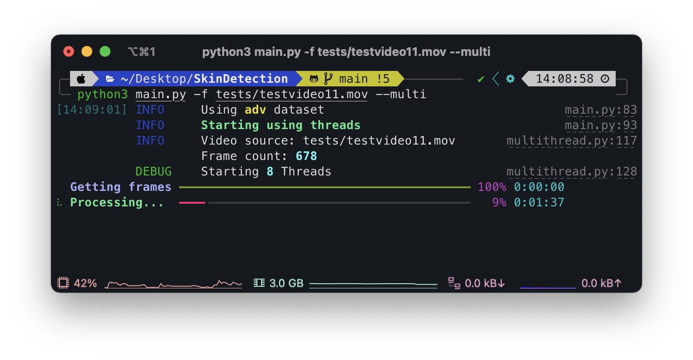

# INSTALL 

## General info

### Python version 
<code>python 3.9.10</code>

### Tested OS 
* ✅ macOS (monterey/catalina)
* ✅ Arch Linux (EndeavourOS)
* ✅ Windows 10

##  Downloads

Clone this repo with:

```
git clone https://github.com/mik3sw/SkinDetection.git
```

> we recommend using this software on macOS or linux. Windows is supported but sometimes we had problems 

>Depending on your system you'll have to use <code>python3</code> or <code>python</code> command, this guide use <b><code>python3</code></b>.

### Python env


```
python3 -m venv env
```

If you're using **Windows**, you had to activate the env with:

```
env\Scripts\activate.bat
```

```
env\Scripts\Activate.ps1
```
Respective on **CMD** and **Powershell**

> if using powershell you run into permissions problems
> ```
> Set-ExecutionPolicy Unrestricted -Scope Process
> ```
> 
> And select 'A'
> 


On **macOS** or **Linux** you can activate the env with:

```
source env/bin/activate
```

### Dependencies

```
pip install -r requirements.txt
``` 


### Dataset

Run this script to download the datased (~500MB):

```
python3 src/setup.py
```


##   Quick start

```
python3 src/main.py -h

python3 src/main.py --info
```


### First start (webcam or processing)

During the very first start will be created the classifier. This might take a while ~10min

##   Live webcam
 <code>python3 main.py</code> will start a live session. **Attention**, performance and precision are very bad.

- **'q'**: choose background
- **'ESC'**: quit live session

Background  | Live processing
----------------- | ----------------
   | 


##  Video processing

You can choose single or multithreading for processing (we recommend multi). 

> Multithread performances:
>* MacBook Pro M1 (8 core/threads)
>	* 1/2 processing time
>* i7 1165G7 (4 core 8 threads)
>	* 1/2 processing time
>* Ryzen 5 1400 (4 core 8 threads), i5 3210M (2 core 4 threads)
>	* no big changes
> 


Here an example on a MacBook Pro M1 (2020)

Single Thread       | Multithreads
:-----------------: | :----------------:
     | 
~4min               | ~2min

### Examples:

Single:

<code>python3 src/main.py -f tests/testvideo.mov</code>  

Multi:

<code>python3 src/main.py -f tests/testvideo.mov --multi</code>
